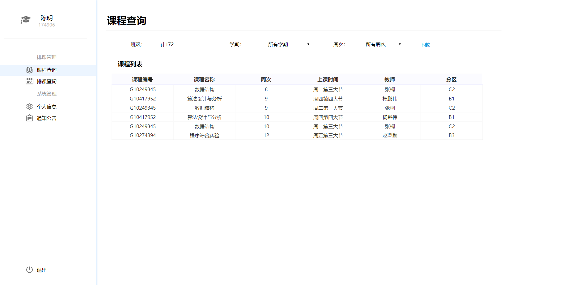
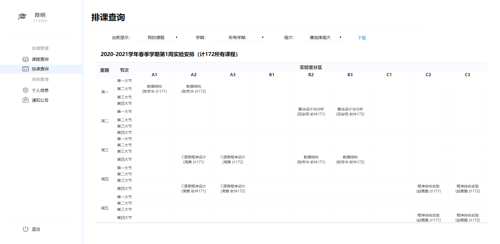
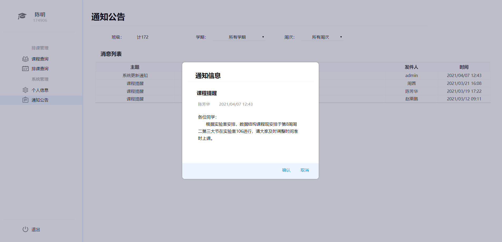

#  实验室排课系统

## 功能

系统面向学生、教师、实验室管理员、系统管理员四类用户。主要实现内容如下：

（1）学生用户具有个人信息管理、课程查询、排课查询、公告查询等功能，进入系统后能修改个人密码，并在课程查询界面和排课查询界面下载相应表格文件。

（2）教师用户可进行个人信息管理、课程管理、排课管理、公告管理等操作，可以创建排课申请并通过通知公告界面向学生用户发送课程通知信息。

（3）实验室管理员用户具有个人信息管理、审核管理、排课管理、公告管理等功能，能够审核教师用户的排课申请并调整实验室排课安排。

（4）系统管理员用户具有用户管理、课程管理、排课管理、公告管理等权限。系统管理员用户可创建其他所有类型用户，并创建课程以满足实验室排课需求。

### 登录模块

+ 为进入实验室排课系统，各类用户均需要输入账号密码进行登录。用户点击登录键后系统会根据账号信息判断用户类型，若账号密码正确系统将打开用户对应主界面。

### 个人信息模块

+ 用户登录后点击“个人信息”，可进入个人信息界面查看用户名、姓名、密码等个人信息。

### 排课查询模块

+  用户点击“排课查询”，可进入排课查询界面根据周次查看实验安排。学生用户选择学期和周次后，系统将自动更新排课表。

### 课程管理模块

+  教师用户登录后点击“课程管理”，可根据学期和周次查看所有已通过审批和所有待审核课程，并查看其详细信息。教师用户选择学期和周次后，系统将自动更新排课表。

### 通知公告模块

+  用户点击“通知公告”，可进入通知公告界面按时间倒序查看通知公告。通知公告包括管理员发布的系统更新公告和教师用户发送的上课提醒。

